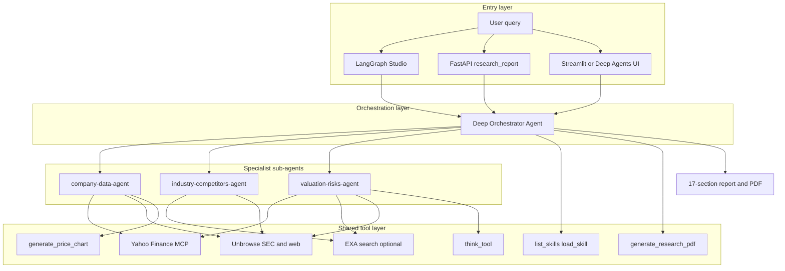

# Deep Finance Research

Company research reports (Morningstar / Value Line style) powered by **Yahoo Finance**, **Unbrowse** (SEC.gov and the web), and optional **EXA**. The agent uses one orchestrator and three specialist sub-agents; reports combine live data and SEC/external insights.

---

## Agent Architecture

The runtime graph is defined in `langgraph.json` and loads `agent.py:agent` as the `research` graph. The implementation uses **deepagents** `create_deep_agent(...)` to create one **orchestrator** (Fireworks-hosted chat model) and **three specialized sub-agents**. The orchestrator decides which specialist to call; each specialist shares the same tool layer. The final answer is synthesized into a structured 17-section company report.

### Architecture diagram



### How the layers work

| Layer | Description |
|-------|-------------|
| **Entry** | Requests arrive via LangGraph Studio, FastAPI `POST /research_report`, or the Streamlit / Deep Agents UI. |
| **Orchestration** | The main agent in `agent.py` holds global instructions, decides what information is missing, and delegates via `task()` to specialist sub-agents. |
| **Specialists** | **company-data-agent**: header, business description, historical financials, financial exhibits (Yahoo, SEC/Unbrowse). **industry-competitors-agent**: market size, competitors, moat, peer set (EXA, Unbrowse). **valuation-risks-agent**: recommendation, valuation, catalysts, risks, management/ESG (Yahoo, EXA, Unbrowse). |
| **Tools** | **live_finance_researcher** uses Yahoo Finance MCP. **Unbrowse** tools (`unbrowse_resolve`, `unbrowse_execute`, etc.) access SEC.gov and other sites via the local Unbrowse server. **exa_*** tools load only when `EXA_API_KEY` is set. **generate_price_chart** returns Plotly JSON; **generate_research_pdf** produces the report PDF. |
| **Output** | The orchestrator merges sub-agent results into one report (narrative, cited sources, chart, and optionally PDF). |

---

## Project structure

```
deep-finance-research/
├── agent.py              # Entry: from deep_research.agent import agent (LangGraph)
├── api.py                # Entry: from deep_research.api import app (FastAPI)
├── app.py                # Streamlit UI (imports agent from deep_research.agent)
├── langgraph.json        # LangGraph config: research -> agent.py:agent
├── run.sh                # Start backend, optional Unbrowse/Streamlit/UI
├── pyproject.toml        # Dependencies (uv); package deep_research
├── .env.example          # Env template (keys, Unbrowse URL, flags)
│
├── deep_research/        # Production package: agent, API, tools, prompts
│   ├── __init__.py
│   ├── config.py        # PROJECT_ROOT
│   ├── agent.py         # Research graph (create_deep_agent, sub-agents)
│   ├── api.py           # FastAPI: /health, POST /research_report
│   ├── prompts.py       # Orchestrator + sub-agent system prompts
│   ├── agent_utils.py   # stream_agent_response
│   └── tools/
│       ├── chart_tools.py   # generate_price_chart
│       ├── rag_tools.py     # live_finance_researcher, think_tool
│       ├── unbrowse_tools.py # Unbrowse API (resolve, execute, feedback, registry)
│       ├── exa_tools.py     # exa_web_search, exa_get_contents
│       ├── pdf_tools.py     # generate_research_pdf
│       ├── skill_tools.py   # list_skills, load_skill
│       └── yahoo_mcp.py     # Yahoo Finance MCP client
│
├── skills/               # LangChain agent skills (skills/<name>/SKILL.md)
│   ├── unbrowse-company-data/   # Local Unbrowse skills (SEC/EDGAR); registry in repo
│   │   ├── SKILL.md
│   │   └── registry.json        # skill_id/endpoint_id for sub-agent reuse (no cloud)
│   └── deep-research-pdf/
│       ├── SKILL.md
│       └── scripts/markdown_report_to_pdf.py
│
├── docs/                 # unbrowse.md, skills-structure.md
└── output/               # Generated PDFs
```

---

## Skills and MCP

### Skills (progressive disclosure)

- **Location**: **`skills/`** at project root (LangChain convention). Each skill is a folder with **`SKILL.md`** (frontmatter: `name`, `description` + body). See `docs/skills-structure.md` and `deep_research.tools.skill_tools`.
- **Mechanism**: Agent calls **list_skills** to see available skills, then **load_skill(skill_name)** to load full instructions; skills can reference tools (e.g. `generate_research_pdf`, Unbrowse tools).
- **Used by this app**:
  - **unbrowse-company-data**: SEC.gov and company data via the **local** Unbrowse server. Skills are **saved in the repo** (`skills/unbrowse-company-data/registry.json`), not the Unbrowse cloud. Sub-agents call **get_unbrowse_registry()** first; if a matching source (e.g. "SEC EDGAR") exists, they use **unbrowse_execute(skill_id, endpoint_id)**. If not, they call **unbrowse_resolve** with **context_url**, then **register_unbrowse_skill** so the skill is persisted for reuse. No API keys or marketplace required. See **Unbrowse (required)** below and `docs/unbrowse.md`.
  - **deep-research-pdf**: Loaded for full company/ticker reports; instructs the agent to call `generate_research_pdf` with the merged report content and save under `output/<TICKER>_research_report.pdf`.

### MCP (Model Context Protocol)

| Integration | Purpose |
|-------------|---------|
| **Yahoo Finance MCP** | Used by **live_finance_researcher** in `deep_research.tools.rag_tools`, which wraps `deep_research.tools.yahoo_mcp`. The Yahoo client is created via `langchain_mcp_adapters.client.MultiServerMCPClient` with `uvx yahoo-finance-mcp-server` (stdio). Provides real-time prices, news, financials, options, etc. |
| **Unbrowse** | Not an MCP server; HTTP API at `UNBROWSE_URL` (default `http://localhost:6969`). Tools in `deep_research.tools.unbrowse_tools`: health, resolve, execute, **get_unbrowse_registry**, **register_unbrowse_skill**, list_skills, skill_detail, feedback. Skills are stored **locally in the repo** (see Unbrowse section below). Required for SEC.gov and external web research. |

---

## API (FastAPI)

Run the API: `uv run uvicorn api:app --reload --port 8000`.

| Method | Endpoint | Description |
|--------|----------|-------------|
| **GET** | `/health` | Liveness check. Returns `{"status": "ok"}`. |
| **POST** | `/research_report` | Run the research agent for the given query. Body: `{"query": "Research AAPL", "thread_id": null}`. Returns `ResearchReportResponse`: `report` (markdown), `tools_used`, `chart_count`, `thread_id`. Requires `FIREWORKS_API_KEY`; for full research, Unbrowse must be running. |

---

## App (Streamlit)

Run the Streamlit app: `uv run streamlit run app.py` (or `./run.sh --streamlit`).

- **Purpose**: Chat UI for the same research agent; shows live tool/agent activity, renders Plotly price charts, and displays the final report.
- **Requirements**: `FIREWORKS_API_KEY` in `.env`; Unbrowse server running for full research.
- **Flow**: User enters a query (e.g. “Research Microsoft”) → orchestrator delegates to the three sub-agents → report and charts are streamed into the UI; PDF is generated at the end under `output/`.

---

## Unbrowse (required)

**Unbrowse is required.** The app will not start if the Unbrowse server is unreachable at startup. This project uses **only the local** Unbrowse server; the **cloud marketplace and API keys are not used**. Skills are saved **in the repo** so sub-agents reuse them without any cloud.

### How Unbrowse skills work (local-only)

1. **Local server** — Unbrowse runs at `http://localhost:6969` (`unbrowse setup` or `npx unbrowse setup`). No `UNBROWSE_API_KEY` is required.
2. **First use** — When a sub-agent (e.g. company-data-agent) needs SEC/EDGAR data, it loads the **unbrowse-company-data** skill and calls **get_unbrowse_registry()**. If the registry has no matching source (e.g. "SEC EDGAR"), it calls **unbrowse_resolve(intent, context_url=...)**. The local server captures the site if needed and returns `skill_id` and `endpoint_id`.
3. **Save in repo** — The agent then calls **register_unbrowse_skill(skill_id, endpoint_id, intent, source_label)** so the skill is written to **`skills/unbrowse-company-data/registry.json`** (LangChain skills layout).
4. **Reuse** — Other sub-agents (or the same agent later) call **get_unbrowse_registry()**, see the "SEC EDGAR" (or other) entry, and use **unbrowse_execute(skill_id, endpoint_id)** directly — no resolve and no cloud.

### Tools and skill

| Tool | Purpose |
|------|--------|
| **get_unbrowse_registry()** | Read skills stored in the repo. Call first; if there is a matching source, use returned `skill_id`/`endpoint_id` with **unbrowse_execute**. |
| **unbrowse_resolve(intent, context_url=...)** | Resolve intent on the local server. Pass **context_url** for first-time capture (e.g. SEC browse-edgar URL for the ticker). |
| **register_unbrowse_skill(...)** | Save a skill in the repo after a successful resolve so other sub-agents can reuse it. |
| **unbrowse_execute(skill_id, endpoint_id, ...)** | Run a known skill (from the registry or from a resolve response). |

The **unbrowse-company-data** skill (`skills/unbrowse-company-data/SKILL.md`) describes the full workflow and intent/context_url patterns for SEC and EDGAR. See **docs/unbrowse.md** for more detail.

### Start and config

- **Start**: `unbrowse setup` or `npx unbrowse setup` (default `http://localhost:6969`), or `./run.sh --unbrowse` to run it with the backend.
- **Config**: Set `UNBROWSE_URL` in `.env` only if you use a different host/port. You do **not** need `UNBROWSE_API_KEY` for the local skill flow; skills are stored in the repo.

---

## Quick start

**Option A – one script (recommended):**

```bash
uv sync
./run.sh --unbrowse                  # backend + Unbrowse
./run.sh --unbrowse --streamlit      # + Streamlit at http://localhost:8501
```

**Option B – separate terminals:**

```bash
# Terminal 1: Unbrowse (required)
unbrowse setup

# Terminal 2: Backend
uv sync
uv run --group dev langgraph dev     # or: langgraph dev

# Terminal 3 (optional): Streamlit
uv run streamlit run app.py
# Or API:
uv run uvicorn api:app --reload --port 8000
```

- **EXA (optional)**: Set `EXA_API_KEY` in `.env` to enable `exa_web_search` / `exa_get_contents`.

---

## Production (DigitalOcean droplet)

Run the pipeline API and Unbrowse in Docker so the full stack is self-contained (no Node or Python on the host beyond Docker).

**Build and run:**

```bash
docker compose -f docker-compose.prod.yml up -d --build
```

Both the API (port 8000) and Unbrowse (port 6969) start. The API uses `UNBROWSE_URL=http://unbrowse:6969` automatically.

**Required env:** Set `FIREWORKS_API_KEY` in `.env` (or pass via compose `environment`). Optional: `EXA_API_KEY`, `UNBROWSE_API_KEY`.

**Unbrowse:** Deployed in the same stack; no need to run Unbrowse on the host.

**Optional:** Put a reverse proxy (Nginx/Caddy) in front of port 8000 for TLS and rate limiting. Use firewall (e.g. ufw) to allow 80/443 (and 6969 if you expose Unbrowse).

**Health:** Use `GET http://<host>:8000/health` for load balancer or orchestrator health checks.

---

## Prerequisites and setup

- **Python**: 3.11+; **uv** for install/run (`uv sync`, `uv run ...`).
- **Node**: For Unbrowse and optional Deep Agents UI (e.g. nvm, Node 24, yarn).
- **Env**: Copy `.env.example` to `.env`; set `FIREWORKS_API_KEY`. Optionally `EXA_API_KEY`, `UNBROWSE_URL`.

See **AGENTS.md** for repo guidelines (structure, commands, style, testing, security).

---

## Troubleshooting

- **Unbrowse required / "Unbrowse is required but not running"**: Start Unbrowse in a separate terminal (`unbrowse setup`) or use `./run.sh --unbrowse`. If the server is not running at backend startup, the app will not start.
- **Where are Unbrowse skills stored?** In the repo: **`skills/unbrowse-company-data/registry.json`**. The Unbrowse cloud dashboard is not used; sub-agents reuse skills via this file and **get_unbrowse_registry** / **unbrowse_execute**.
- **Connection refused on port 6969 / Kuri**: Unbrowse uses Kuri (Zig CDP broker). Set `KURI_BIN` or `KURI_PATH` per Unbrowse docs, or build Kuri so `~/kuri/zig-out/bin/kuri` exists.
