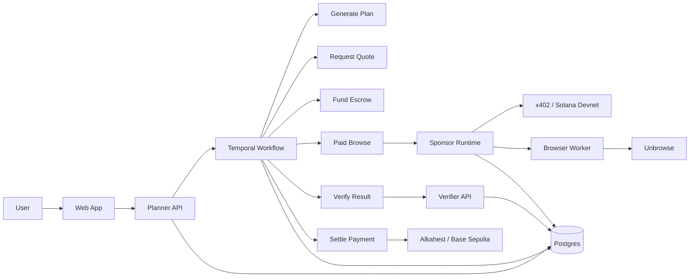

# Proof-of-Browse

Proof-of-Browse is a hackathon app for paid browser automation. A planner agent turns a user goal into URL-scoped tasks, requests quotes from a browser worker, pays the worker through a 402/x402-style HTTP flow, sends the returned evidence to a deterministic verifier, and then releases or refunds escrow. Planner execution now runs as a Temporal workflow so you can watch every quote, payment, browse, verification, and settlement activity in Temporal UI while the product UI mirrors the same persisted state.

## What This App Is

Proof-of-Browse is a multi-agent browser-task orchestration app.

The core idea is:
- a user asks for a web task, such as comparing pricing pages
- a planner agent turns that into one or more browser tasks
- a browser worker performs the task and returns evidence
- a verifier checks the evidence deterministically
- the payment and escrow layer records whether funds should be released or refunded

This app is designed to demonstrate:
- browser agents that do useful web work
- agent-to-agent payment with x402
- escrow and settlement with Alkahest-compatible flows
- visible workflow execution through Temporal

## What Problem It Solves

Most “AI agent” demos hide the important parts:
- who decided what to do
- who performed the work
- how the work was verified
- how money moved between agents

Proof-of-Browse solves that by making the full agent workflow visible and auditable:
- the planner decision is persisted
- the browser execution returns structured evidence
- the verifier applies deterministic rules
- payment and escrow events are recorded
- the full workflow is visible in both the app UI and Temporal UI

## How To Use It

### User flow

1. Open the web app at `http://127.0.0.1:3000`.
2. Create a job with:
   - a goal
   - one or more URLs
   - a max budget
3. Click `Run Job`.
4. Watch the run in:
   - the app workflow panel
   - the planner trace
   - the settlement timeline
   - Temporal UI at `http://127.0.0.1:8088`

### What the app does during a run

1. The planner API creates a job and task records.
2. A Temporal workflow starts.
3. The planner generates a plan.
4. The worker is asked for a quote.
5. Escrow is funded.
6. The paid browse request is executed through the sponsor runtime.
7. The browser worker returns structured evidence.
8. The verifier checks the evidence.
9. The app records release or refund settlement.

## Platforms And Packages

### Platforms used

- **Frontend**: Next.js + React
- **Planner API**: FastAPI + SQLAlchemy + Temporal Python SDK
- **Browser worker**: FastAPI + Unbrowse integration
- **Verifier**: FastAPI
- **Workflow engine**: Temporal
- **Payment runtime**: x402 on Solana devnet
- **Escrow runtime**: Alkahest / Base Sepolia
- **Storage / persistence**:
  - Postgres
  - Redis
  - local artifact storage for screenshots / JSON evidence

### Key package/runtime usage

- `apps/planner-api`
  - `fastapi`
  - `sqlalchemy`
  - `httpx`
  - `temporalio`
  - `psycopg`
- `apps/browser-worker`
  - `fastapi`
  - `httpx`
- `apps/verifier-api`
  - `fastapi`
  - `pydantic`
- `apps/sponsor-runtime`
  - `@x402/core`
  - `@x402/express`
  - `@x402/fetch`
  - `@x402/svm`
  - `alkahest-ts`
  - `express`
  - `viem`
  - `unbrowse`
- `apps/web`
  - `next`
  - `react`
  - `react-dom`

## Agent Architecture

### Agent roles

- **User**: defines the job goal, URLs, and budget
- **Planner agent**: decomposes the job and orchestrates execution
- **Browser worker agent**: performs the paid browse task and returns evidence
- **Verifier agent**: checks whether the evidence satisfies deterministic rules
- **Settlement layer**: records funded, released, or refunded outcomes

### Mermaid diagram



## Repo layout

```text
apps/
  web/
  planner-api/
  browser-worker/
  verifier-api/
  sponsor-runtime/
packages/
  shared-schemas/
docs/
infra/
.codex/
```

## Architecture

- `apps/web`: Next.js UI for job submission, task board, evidence drawer, and settlement timeline.
- `apps/planner-api`: FastAPI planner, persistence, Temporal workflow launcher, and app-level escrow metadata.
- `apps/browser-worker`: FastAPI browser worker with Unbrowse-only extraction and local evidence artifact storage.
- `apps/verifier-api`: FastAPI verifier with deterministic evidence rules.
- `apps/sponsor-runtime`: Node runtime that uses `@x402/*` for Solana devnet payments and `alkahest-ts` for Arkhai/Alkahest escrow settlement.
- `packages/shared-schemas`: Shared TypeScript schemas and generated JSON schema/OpenAPI artifacts.
- `docs`: PRD, architecture, API contracts, demo script, and repo docs MCP.

## Quick start

### One-command local run

```bash
./run.sh demo
```

This script:
- starts Docker infra, including Temporal and Temporal UI
- ensures each Python `.venv` and Node install exists
- runs planner migrations against the local SQLite demo DB
- starts planner API, Temporal worker, browser worker, verifier API, sponsor runtime, and web app

It keeps the app processes attached until you press `Ctrl+C`. Service logs are written under `/tmp/proof-of-browse-logs` on macOS/Linux.

For strict sponsor-backed startup:

```bash
./run.sh real
```

`real` mode refuses to start unless the required OpenAI, Solana/x402, and Alkahest secrets are present, and it uses planner Postgres instead of the local SQLite demo DB.

Create either one shared root `.env` from [.env.example](/Users/pramodthebe/Desktop/proof-of-browser/.env.example), or per-service `.env` files from:
- [apps/planner-api/.env.example](/Users/pramodthebe/Desktop/proof-of-browser/apps/planner-api/.env.example)
- [apps/browser-worker/.env.example](/Users/pramodthebe/Desktop/proof-of-browser/apps/browser-worker/.env.example)
- [apps/verifier-api/.env.example](/Users/pramodthebe/Desktop/proof-of-browser/apps/verifier-api/.env.example)
- [apps/sponsor-runtime/.env.example](/Users/pramodthebe/Desktop/proof-of-browser/apps/sponsor-runtime/.env.example)

The planner API and browser worker now load both the repo root `.env` and their local service `.env`, with the local file taking precedence.

For the sponsor-backed path, also run Unbrowse locally:

```bash
npx unbrowse setup
```

### Infra

```bash
docker compose -f infra/docker-compose.yml up -d
```

### Planner API

```bash
cd apps/planner-api
python3 -m venv .venv
source .venv/bin/activate
pip install -e .[dev]
python scripts/migrate.py
python scripts/seed_demo.py
uvicorn app.main:app --reload --port 8001
```

### Temporal worker

```bash
cd apps/planner-api
source .venv/bin/activate
python -m app.temporal.worker
```

### Browser worker

```bash
cd apps/browser-worker
python3 -m venv .venv
source .venv/bin/activate
pip install -e .[dev]
uvicorn app.main:app --reload --port 8002
```

### Verifier API

```bash
cd apps/verifier-api
python3 -m venv .venv
source .venv/bin/activate
pip install -e .[dev]
uvicorn app.main:app --reload --port 8003
```

### Sponsor runtime

```bash
cd apps/sponsor-runtime
npm run dev
```

### Web app

```bash
cd apps/web
npm install
npm run dev
```

### Temporal UI

Open `http://localhost:8088` after `docker compose -f infra/docker-compose.yml up -d`.

## Database migrations and seed

Planner persistence is the source of truth for jobs, tasks, quotes, verification results, and settlement events.

```bash
cd apps/planner-api
python scripts/migrate.py
python scripts/seed_demo.py
```

## Testing

### Planner API

```bash
cd apps/planner-api
pytest
```

### Browser worker

```bash
cd apps/browser-worker
pytest
```

### Verifier API

```bash
cd apps/verifier-api
pytest
```

### Shared schemas

```bash
cd packages/shared-schemas
npm test
```

## Workflow execution

- `POST /jobs/{id}/run` now queues a Temporal workflow instead of completing the whole job inline.
- `GET /jobs/{id}` includes both planner state and a typed `workflow` object with Temporal IDs and current activity.
- `GET /jobs/{id}/workflow` returns the persisted workflow summary for the web app and operator tooling.
- The app UI shows a workflow execution panel, while Temporal UI shows the low-level workflow history and retries.

## Payment modes

- `PAYMENT_MODE=mock`: Browser worker returns a 402-style challenge and accepts a mock payment retry header.
- `PAYMENT_MODE=real`: Planner pays the sponsor runtime through `@x402/fetch` using Solana devnet, and the sponsor runtime exposes the paid route through `@x402/express`.

## Planner modes

- `PLANNER_PROVIDER=auto`: Use OpenAI when `OPENAI_API_KEY` is set, otherwise fall back to the deterministic planner.
- `PLANNER_PROVIDER=openai`: Require the OpenAI Responses API planner path.
- `PLANNER_PROVIDER=deterministic`: Disable the OpenAI planner and use local deterministic planning.

## Settlement modes

- `SETTLEMENT_MODE=app`: Persist local escrow state transitions only.
- `SETTLEMENT_MODE=alkahest`: Persist Alkahest-compatible escrow metadata using the Base Sepolia ERC20 escrow and TrustedOracleArbiter contract addresses, so the planner timeline reflects the Arkhai sponsor flow.
- `SETTLEMENT_MODE=alkahest`: Fund, arbitrate, collect, or reclaim real Base Sepolia escrows through `alkahest-ts`.

## Demo path

Use the seeded success and failure jobs or submit a new job in the web app with three pricing URLs. Run the job, open the workflow execution panel, inspect the same run in Temporal UI, then show the screenshot/excerpt evidence and the settlement timeline moving from quote to funded to paid to verified and released or refunded.

## Sponsor-oriented local run

1. Start infra, including Temporal and Temporal UI.
2. Start Unbrowse with `npx unbrowse setup`.
3. Start `apps/planner-api`, `python -m app.temporal.worker`, `apps/browser-worker`, `apps/verifier-api`, and `apps/sponsor-runtime`.
4. Set `OPENAI_API_KEY` and `PLANNER_PROVIDER=openai` to enable a real planner call.
5. Set `PAYMENT_MODE=real` to exercise the real Solana devnet x402 flow.
6. Set `SETTLEMENT_MODE=alkahest` plus the Base Sepolia private keys and RPC URL to execute live escrow settlement.
7. Run a job from the web app and inspect the workflow panel, Temporal UI, Unbrowse, x402, and Arkhai panels plus `planner_trace` and `settlement_events`.

## Proving Real Integrations

Use this checklist when you want to prove the app is running with live sponsor integrations instead of demo fallbacks.

### Required setup

Add these secrets to your root `.env` before running `./run.sh real`:

```bash
APP_MODE=real
PLANNER_PROVIDER=openai
PAYMENT_MODE=real
SETTLEMENT_MODE=alkahest

OPENAI_API_KEY=

X402_SOLANA_PRIVATE_KEY=
X402_PAY_TO=

ALKAHEST_RPC_URL=
ALKAHEST_BUYER_PRIVATE_KEY=
ALKAHEST_WORKER_PRIVATE_KEY=
ALKAHEST_ORACLE_PRIVATE_KEY=
```

You also need:
- a working local Unbrowse instance reachable at `UNBROWSE_URL`
- a funded Solana devnet wallet for x402 payments
- a valid payee address for x402
- funded Base Sepolia buyer, worker, and oracle wallets for Alkahest

Start the app in strict real mode:

```bash
./run.sh real
```

### What proves each integration

#### OpenAI planner

Create and run a job, then verify:
- `trace_events` includes `plan_created`
- `trace_events[].metadata.provider` is `openai`
- the run does not succeed through deterministic fallback

Inspect in:
- the web app planner trace
- Temporal activity `generate_plan`
- `GET /jobs/{id}`

#### Unbrowse

Verify:
- `execution_results[].provider` is `unbrowse`
- `execution_results[].provider_run_id` is non-empty
- `execution_results[].provider_metadata` contains Unbrowse fields
- if Unbrowse is unavailable, the task fails instead of falling back to another browser executor

Inspect in:
- the web app evidence/execution section
- Temporal activity `pay_and_browse`
- `GET /jobs/{id}`

#### x402 on Solana devnet

Verify:
- `payment_challenged` and `payment_settled` trace events are present
- trace metadata shows `payment_mode: real`
- payment metadata includes `payment_response_header`
- decoded payment response is present

Inspect in:
- the web app sponsor/x402 panel
- Temporal activity `pay_and_browse`
- `GET /jobs/{id}`

#### Alkahest escrow

Verify `settlement_events` contain live chain artifacts:
- `escrow_uid`
- `fund_tx_hash`
- `arbitration_decision_tx_hash`
- `collect_tx_hash` on success
- `reclaim_tx_hash` on refund

Inspect in:
- the web app settlement timeline
- Temporal activities `fund_escrow` and `settle_task`
- `GET /jobs/{id}`

### Minimum proof run

For one real proof run, all of these should be true in the final job payload:
- planner trace shows `provider: openai`
- execution result shows `provider: unbrowse`
- payment trace shows `payment_mode: real`
- settlement metadata includes live Alkahest tx hashes
- workflow completes in Temporal UI without demo fallback behavior

## Documentation

- `docs/prd.md`
- `docs/architecture.md`
- `docs/api-contracts.md`
- `docs/demo-script.md`
- `docs/proof-checklist.md`
