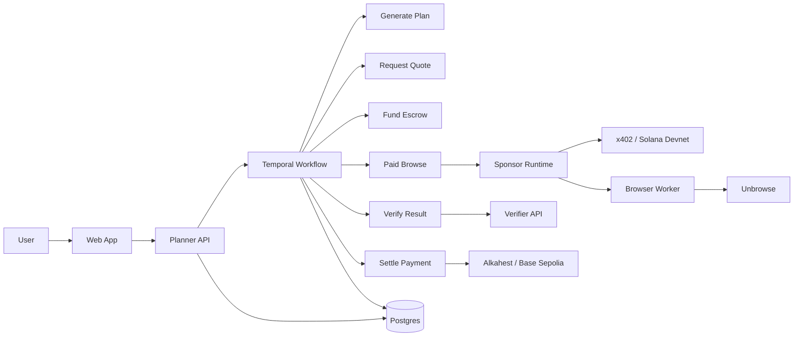

# Proof-of-Browse Architecture

## Purpose

Proof-of-Browse is an agent orchestration system for paid browser work.

It exists to show a complete agent workflow:
- a planner decides how to execute a job
- a browser worker performs the web task
- a verifier checks the returned evidence
- a payment and escrow layer records whether funds should be released or refunded
- Temporal shows the workflow execution and failure points

## Problem the architecture solves

The system is designed to make agent execution inspectable instead of opaque.

It provides:
- explicit task decomposition
- explicit worker execution
- deterministic verification
- payment and escrow event visibility
- workflow-level observability through Temporal

## Agent roles

- **User**: creates jobs and monitors results
- **Planner agent**: decomposes the goal, schedules work, and owns state transitions
- **Browser worker agent**: executes paid web tasks and returns structured evidence
- **Verifier**: applies deterministic pass/fail rules
- **Settlement runtime**: persists payment and escrow outcomes

## Mermaid diagram



## Service diagram

```text
Web App
  -> Planner API
       -> Temporal server / Temporal UI
       -> Sponsor Runtime
            -> Browser Worker API
            -> x402 facilitator
            -> Base Sepolia / Alkahest contracts
       -> Verifier API
       -> Postgres
       -> Redis
Browser Worker
  -> Unbrowse local API
  -> Local artifact storage
Verifier API
  -> Deterministic rules only
Temporal Worker
  -> Planner workflow activities
  -> Sponsor Runtime / Browser Worker / Verifier
  -> Planner Postgres state updates
```

## Platform and package summary

- **Web app**: Next.js, React
- **Planner API**: FastAPI, SQLAlchemy, HTTPX, Temporal Python SDK
- **Browser worker**: FastAPI, HTTPX, Unbrowse integration
- **Verifier**: FastAPI, Pydantic
- **Sponsor runtime**: Express, `@x402/*`, `alkahest-ts`, `viem`, `unbrowse`
- **Persistence**: Postgres, Redis, local artifact storage
- **Workflow engine**: Temporal

## Request flow

1. User submits a job with a goal, URL list, and budget.
2. Planner creates a job plus one deterministic task per URL.
3. Planner API starts a Temporal workflow and persists workflow identifiers on the planner run.
4. Temporal worker executes quote, escrow funding, paid browse, verification, and settlement as separate activities.
5. Sponsor runtime challenges with 402 until x402 payment is settled.
6. Browser worker uses Unbrowse for extraction and returns structured output with persisted evidence artifacts.
7. Temporal activities persist quotes, execution results, verification results, settlement events, and trace events into Postgres.
8. Web app polls planner state and renders the task board, workflow panel, planner trace, and settlement timeline.

## State transitions

### Job states
`created -> queued -> planning -> quoted -> funded -> payment_sent -> running -> awaiting_verification -> verified -> released`

Failure path:
`running -> awaiting_verification -> refunded` or `failed`

### Task states
`pending -> quoted -> accepted -> running -> completed -> verification_passed`

Failure path:
`running -> completed -> verification_failed`

## Payment flow

- Mock mode:
  - Worker returns `402 Payment Required` with a structured challenge.
  - Planner retries with `x-mock-payment`.
  - Worker accepts and processes the task.
- Real mode:
  - Planner workflow activities use isolated `PaymentClient` and `PaymentGate` implementations.
  - Solana devnet and facilitator config live in environment variables.
  - Temporal UI shows each payment-related activity and retry separately.

## Verification flow

The verifier checks screenshot presence, domain match, required field presence, excerpt support, HTML hash, timestamp, and deadline compliance. It returns a boolean, a deterministic score, and machine-readable reasons.
